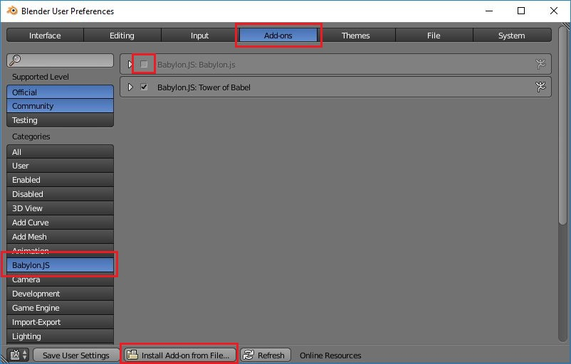

# Blender to Babylon.js exporter

## Installation

- Download the [latest version](https://github.com/BabylonJS/Exporters/blob/master/Blender/Blender2Babylon-5.6.zip?raw=true).
- Goto Blender `User Preferences` from the `File` menu.
- Switch to the `Add-ons` tab.
- Click the `Install from File...` button at the bottom.
- Select the zip file.  Do not expand.  Blender does that.
- Switch to the new Category now added, `Babylon.JS`
- Enable the exporter using the checkbox.
- Click `Save User Settings` if you wish it enabled every session.

## Documentation
See the [exporters documentation](http://doc.babylonjs.com/exporters) for a list of [features](http://doc.babylonjs.com/resources/blender#features), some [tips](http://doc.babylonjs.com/resources/blender_tips) and others.

Tower of Babel extension can be found [here](https://github.com/BabylonJS/Extensions/tree/master/QueuedInterpolation/Blender), see its [readme](https://github.com/BabylonJS/Extensions/blob/master/QueuedInterpolation/Blender/README.md) to know more.

If you think something missing in the Blender exporter documentation, please report it through github issues, or in this [forum thread](http://www.html5gamedevs.com/topic/36596-blender-exporter-doc-needs-feedback/).

## Changelog

Changelog can be [found here](https://github.com/BabylonJS/Exporters/blob/master/Blender/changelog.md).